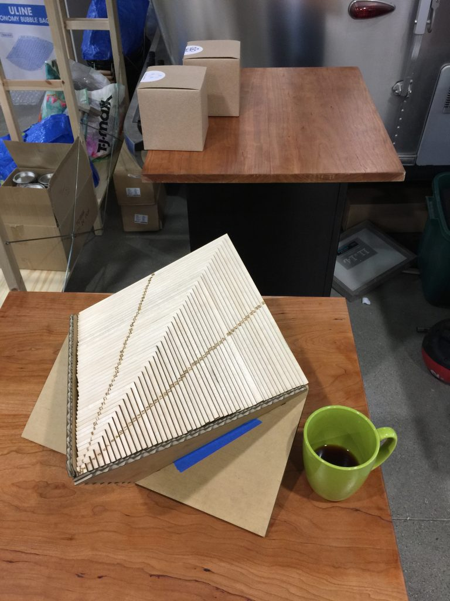

Consider that innocent sounding question. Give it a try, then come back...

This turns out to be remarkably difficult. It is even more difficult if the rectangle you are cutting up is itself a square.

A solution to the problem is called aperfect squared rectangle. Perfect here means that all of the squares are different sizes. If the rectangle is not composed of smaller perfect squared rectangles, then it is asimple perfect squared rectangle.

[Archimedes](http://pi.math.cornell.edu/~mec/GeometricDissections/1.2%20Archimedes%20Stomachion.html) wrote about dissecting squares over 2000 years ago. Yet the first perfect squared rectangles [were not discovered until 1925](http://www. [squaring.net](http://www.squaring.net/)/history_theory/z_moron.html). One of those rectangles (pictured below) is 33x32 and uses nine squares, which is the fewest possible. Can you determine the size of the smallest square?

There is an excellent [Numberphile](https://www.youtube.com/watch?v=NoRjwZomUK0&vl=en) video describing this problem and its history, which is known as Squaring the Square. Most of the methods used to find perfect squared rectangles were developed at Cambridge University by four students in the [Trinity Mathematical Society](https://en.wikipedia.org/wiki/Trinity_Mathematical_Society). They found a useful way to represent the rectangle and its squares as an electrical circuit, and applied [Kirchhoff's circuit laws](https://en.wikipedia.org/wiki/Kirchhoff%27s_circuit_laws) to help find solutions. For a more detailed description of this and related problems, take a look at [squaring.net](http://www.squaring.net/).

We have created a puzzle which we introduced at the [2019 JMM.](http://www.jointmathematicsmeetings.org/jmm) It uses squares with side lengths from 1x1 to 50x50. There are 64 ways you can assemble a subset of these squares into simple perfect squared rectangles. To give you a sense of scale, the 50x50 has 10 inch sides.

## Images

