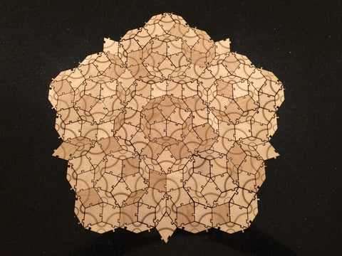

[Roger Penrose](https://en.wikipedia.org/wiki/Roger_Penrose) is well known for his collaborations with [Stephen Hawking](https://en.wikipedia.org/wiki/Stephen_Hawking) studying black holes. Perhaps being a cosmologist made him interested in the work of [Kepler](https://en.wikipedia.org/wiki/Johannes_Kepler). And perhaps that led him to thinking about [tilings with pentagons](http://www.cherryarbordesign.com/design-note-5-tiling-with-regular-polygons/). In any case, he ended up discovering a some remarkable things about tiling. In particular, he discovered [Penrose tiles](https://en.wikipedia.org/wiki/Penrose_tiling). He described three such tilings, called P1, P2, and P3.

Here are some examples of patches of P3 tiles.

P3 [Penrose tiles](https://en.wikipedia.org/wiki/Penrose_tiling) could just be two simple rhombuses (thick and thin), but you would have to follow special rules to determine whether two tile edges can be matched. But those rules can just be implemented by altering the edges to limit how you can connect the tiles. Remarkably, the resulting tiling is guaranteed to be [aperiodic](https://en.wikipedia.org/wiki/Aperiodic_tiling), which means it is not a typical repeating wallpaper-style pattern.

Amazingly, Penrose's tilings ended up being useful in explaining physical phenomena that was discovered after Penrose discovered the tiles. You can read more about applications to crystallography, as well as the notion of inflation in the article [Penrose Tiles talk across the Miles](http://www.ams.org/samplings/feature-column/fcarc-penrose).

## Images

