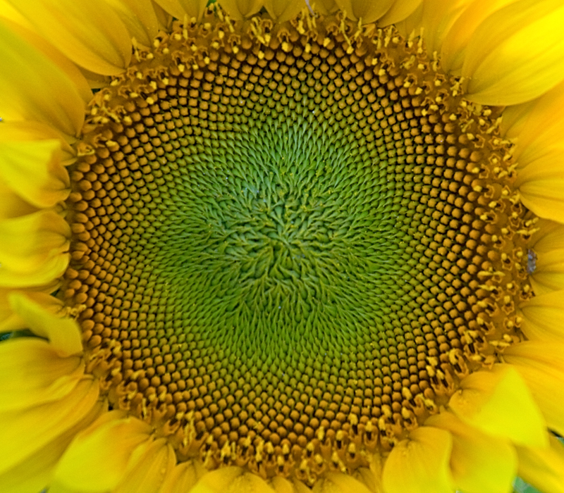

[Fibonacci](https://en.wikipedia.org/wiki/Fibonacci)'s[famous sequence](https://en.wikipedia.org/wiki/Fibonacci_number)(0, 1, 1, 2, 3, 5, 8, 13, 21, 34, 55, ...) has been linked to many natural phenomena. The[arrangement of seeds in sunflowers](http://momath.org/home/fibonacci-numbers-of-sunflower-seed-spirals/)is one example.

The[construction of the sunflower spiral](https://thatsmaths.com/2014/06/05/sunflowers-and-fibonacci-models-of-efficiency/)can be described as a series of steps, moving out a certain distance from the center of the circle and rotating a fixed angle for each seed. Play around with this by adjusting the distance and angle below.

So, you can create some beautiful patterns, and with the laser cutter, you could cut out the circles. But I was also interested in the idea of the dots representing the center of cells. Enter the[Voronoi diagram](https://en.wikipedia.org/wiki/Voronoi_diagram). Given a set of points, it finds cells containing those points, with the property that any border that separates two points is equidistant from the points.

We think this evokes the idea of biological cells, and led to our abstract Cellular Clock:

[Eko Hironaka](https://www.math.fsu.edu/~hironaka/)was interested in a design that was more suggestive of 12 hours, and created the design for Eko's Flower.

## Images

