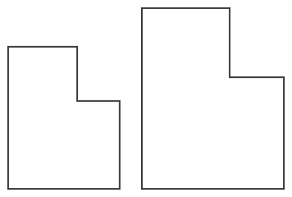

At a[JMM](https://www.jointmathematicsmeetings.org/)conference, mathematician[Keith Copenhaver](https://www.eckerd.edu/mathematics/faculty/copenhaver/)called our attention to [Robert Ammann](https://en.wikipedia.org/wiki/Robert_Ammann)'s Golden b tiling. It is unlike the tilings we see around us every day. Most tilings areperiodic(see[wallpaper groups](https://en.wikipedia.org/wiki/Wallpaper_group)). In a periodic tiling, you can find two points where the tiling looks identical. In fact, if there are two, there will be infinitely many such points.

Mathematicians discovered[aperiodic](https://en.wikipedia.org/wiki/Aperiodic_tiling)tilings in the 1960s. Aperiodic tilings must be able to tessellate (i.e. fill in) the entire plane, and use only a fixed number of tile types. Most importantly, any tessellation with the tiles must be non-repeating in this sense: pick any two points in the tessellation, and the tiling must look different at those points.

[Robert Ammann](https://en.wikipedia.org/wiki/Robert_Ammann)was an early researcher in [aperiodic](https://en.wikipedia.org/wiki/Aperiodic_tiling) tilings. Remarkably, he was not a professional mathematician—he was a postal worker with a passion for discovering new tilings. One of the tilings he discovered is based on a single tile shape, in two different sizes. The ratio of the area of the larger tile to the smaller is the golden ratio, also known by the greek letter phi, writtenɸ. Note that the tile is shaped like a chunky letter b, hence the affectionate moniker "Golden b."

You can combine the two tiles to create another similar tile:

This suggests you can continue combining tiles to make arbitrarily large copies of the Golden b.

As you build a tessellation with the Golden b, adding more and more pieces, the ratio of the number of large to small tiles converges to…ɸ.

## Images

