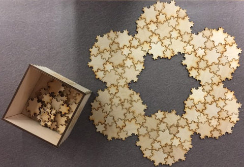

The[Koch snowflake](https://en.wikipedia.org/wiki/Koch_snowflake)is one of the first fractal curves to be described.

Like other fractal curves, it has an infinitely long boundary, and the self-similarity is obvious as you zoom in. One of the cool things about the [Koch snowflake](https://en.wikipedia.org/wiki/Koch_snowflake) is that it can be built from six smaller snowflakes, leaving another snowflake in the middle. That of course can also be decomposed, recursively, giving you this:

So that led to one of our first puzzles, which uses two sizes of snowflakes. I put the box of pieces in the Mathematics Commons at the University of Michigan. Both of the patterns below were created there.

Putting it together, in holiday colors...

## Images

