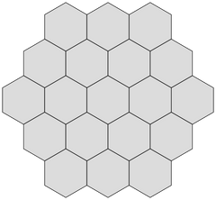
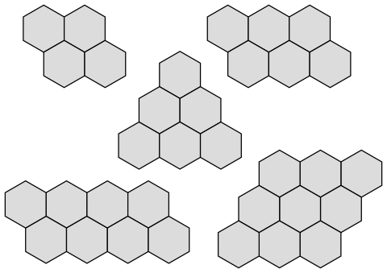
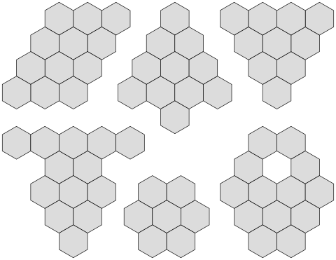

We've developed an interest in puzzles that use a single tile shape and have markings on the tiles that create loops, roads, or even knots. Most of those examples have square tiles, although Triknots tiles are triangles. And we like the design pattern of creating all the variations of a marking scheme.
We decided to play around with hexagon-shaped pieces that have elements of the other tiles. Like Cipra Loops and Cipra City, we wanted each piece to be unique. Like the knot tilings, we didn't want to require a particular orientation. Borrowing a theme from Cipra City, we made the tile markings suggestive of roads, in this case with a roundabout in the center of the tile.
Each Roundabout tile has at least one road that radiates out to an edge. For example, here is a Roundabout tile with two roads, and 4 open edges:
Because you can rotate the tiles, it's the same as this tile:
Here are the Roundabout tiles that we use:
Are these all of the possible roundabouts?
To play around with Roundabout tiles, you can make your own by
[printing this page](https://github.com/pbenson/pbenson.github.io/blob/main/files/RoundaboutTilesForCutout.pdf?raw=true)
, and cutting them out. Or you can draw the roads on
[hexagonal graph paper](https://github.com/pbenson/pbenson.github.io/blob/main/files/hexagonSheet1cm.pdf?raw=true)
. Or
[order them from our shop](https://cherryarbordesign.com/products/roundabouts)
.
Now, can you create a configuration (i.e. a map) of roundabouts with no roads ending at an edge? It's easy if we allow duplicate tiles. Here is the simplest map, consisting of two tiles (
[Barry Cipra](https://en.wikipedia.org/wiki/Barry_Arthur_Cipra)
calls tiles these
U-turns
).
The U-turn on the right has a white center to indicate it is a duplicate tile. It's clear there is no 2-tile map without duplicates. Is there a 3-tile map without duplicates? A 4-tile map?
If you're trying this out, you'll discover it is a challenge to create a map without duplicates. Here's a hint though: it is possible! Nevertheless, allowing a tile to be duplicated even once dramatically increases the number of possible maps.
Here are some maps that can be solved using just one duplicate tile:
Here are maps that can be solved needing at least two duplicate tiles:
And here are maps that can be solved with four duplicate tiles:
With any given map, it is interesting to ask whether the number of duplicates is as small as possible. This map can be made with six duplicates. Is it possible to use fewer than six duplicates for this map?

## Images

