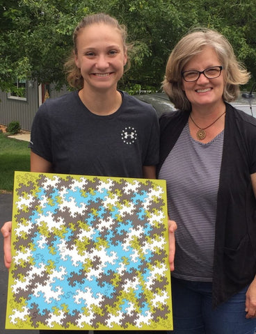
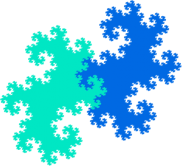

After creating the[Dragon tiles](https://cherry-arbor-design.myshopify.com/blogs/news/here-be-dragons), we decided it would be fun tessellating with[Twin Dragon fractals](https://en.wikipedia.org/wiki/Dragon_curve#Twindragon). Twin dragons have much more frilly edges. An individual twin dragon clearly shows self-similarity. Note the wave-like structure, repeated at smaller and smaller scales:

Each smaller wave is half of the area of the larger wave. And this means that a twin dragon fractal can be made from two smaller copies of itself:

All of the descriptions of the Twin Dragon that I knew of focused on the space-filling curve that defines the interior of the dragon. But I wanted to generate just the border.[Dylan Thurston](http://pages.iu.edu/~dpthurst/)found an elegant procedure that enabled us to create Twin Dragon boundaries at any level of detail. So, like the dragons, we created pieces of different sizes that fit together. Then  we created this framed version of a complete set of our tiles.

Heidi used colors that evoke mid-century modern. You can find other colors in[our store](https://cherry-arbor-design.myshopify.com/products/twin-dragon-fractal-tiles).

We loved it when our daughter-in-law, Karen, paid us a visit and did her own tessellating with [Twin Dragon fractals](https://en.wikipedia.org/wiki/Dragon_curve#Twindragon):

## Images

